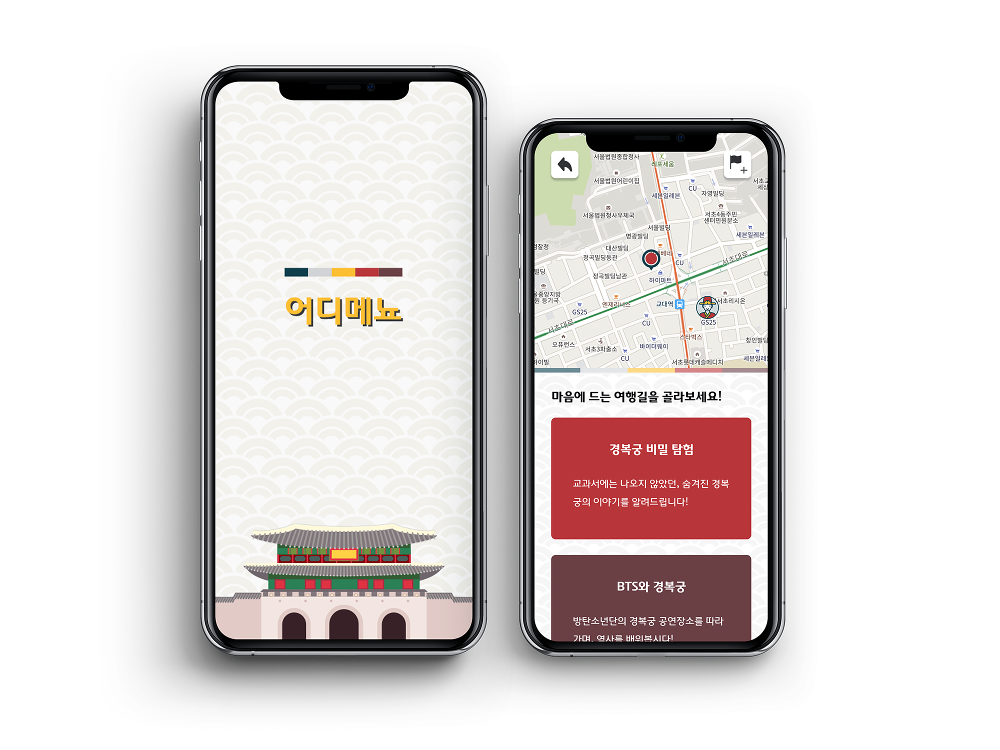

# Cultural Heritage

A platform where you can find cultural heritage around you and record and share voice guides.

## Features
- Recording audio guide with a mobile browser
- A way to draw a way point easily
- Finding the heritage around me

## Stack
- Google Maps API
- Firebase
- React JS

## Live Demos
[Links](https://cultural-heritage.web.app/)
